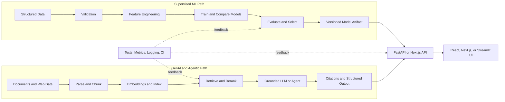

# Vishal Kumar Kashyap

### AI/ML Engineer · Deep Learning · NLP · RAG · Agentic AI

I build **end-to-end intelligent systems** — from data validation, feature engineering, and model evaluation to retrieval pipelines, tool-using agents, APIs, and deployed user interfaces.

My work spans **supervised machine learning, deep learning for NLP, semantic retrieval, grounded generation, agent orchestration, and AI product engineering**.

  
  
  
  
  
  
  
  

> **Open to:** AI/ML Engineer · GenAI Engineer · Applied AI Engineer · NLP/RAG Engineer roles

---

## What I Work On

| Area | Engineering focus | Public evidence |
|---|---|---|
| **Machine Learning** | Data validation, feature engineering, model comparison, classification metrics, model serialization, inference pipelines | [Workforce Intelligence Platform](https://github.com/kumarvishal10351/workforce-intelligence-platform) |
| **Deep Learning & NLP** | Text normalization, tokenization, sequence modeling, class balancing, BiGRU networks, regularization, neural inference | [Emotion Detector](https://github.com/kumarvishal10351/Emotion-Detector) |
| **Retrieval-Augmented Generation** | Document ingestion, chunking, embeddings, dense and hybrid retrieval, reranking, grounding, citations | [AURA](https://github.com/kumarvishal10351/-AURA-Adaptive-Unified-Retrieval-Assistant) · [Context-Aware RAG](https://github.com/kumarvishal10351/Document-Summarizer-RAG-) |
| **Agentic AI** | ReAct agents, tool use, task routing, multi-stage orchestration, memory, structured outputs, failure handling | [AI Research Multi-Agent System](https://github.com/kumarvishal10351/AI-Research-Multi-Agent-System) |
| **AI APIs & Products** | FastAPI, REST, SSE, typed schemas, lifecycle-managed models, React/Next.js interfaces, live deployments | [Company-AI](https://github.com/kumarvishal10351/Company-AI) · [Emotion API](https://emotion-detector-8iae.onrender.com/docs) |
| **Computer Vision** | Facial landmarks, EAR/MAR analysis, head-pose estimation, temporal state machines, calibration and alerts | [Driver Drowsiness Detection](https://github.com/kumarvishal10351/Driver-Drowsiness-Detection-System) |

---

## Selected Engineering Work

### 1. [Workforce Intelligence Platform](https://github.com/kumarvishal10351/workforce-intelligence-platform) — End-to-End Machine Learning

Employee-attrition intelligence system covering the complete supervised-ML workflow from raw tabular data to live predictions.

- Built a **four-stage validation pipeline** for file, schema, datatype, and business-rule checks.
- Implemented feature engineering, preprocessing, stratified splitting, candidate-model training, evaluation, and artifact persistence.
- Compared Logistic Regression, Decision Tree, Random Forest, and Gradient Boosting models.
- Documented Gradient Boosting evaluation: **88.08% ROC-AUC, 87.40% precision, and 76.25% recall**.
- Served predictions through **FastAPI** and built an executive **React 19 + Vite** dashboard with batch upload and what-if simulation workflows.

`Python` `Scikit-learn` `Pandas` `FastAPI` `React` `Model Evaluation` `Data Validation`

---

### 2. [Emotion Detector](https://github.com/kumarvishal10351/Emotion-Detector) — Deep Learning for NLP

Six-class emotion-classification system trained on the **DAIR-AI Emotion** dataset and deployed as a neural inference API.

- Designed a stacked **Bidirectional GRU** network with a learned embedding layer, dropout regularization, and softmax classification.
- Applied text normalization, vocabulary tokenization, sequence padding, and class-weight balancing.
- Achieved **92.55% accuracy in the recorded notebook evaluation** across sadness, joy, love, anger, fear, and surprise.
- Serialized the Keras model and tokenizer, then loaded them through the FastAPI application lifespan for reusable inference.
- Exposed validated `/predict` and `/health` endpoints with probability distributions and a responsive browser interface.

`TensorFlow` `Keras` `BiGRU` `NLP` `Sequence Modeling` `FastAPI` `Pydantic`

---

### 3. [AURA](https://github.com/kumarvishal10351/-AURA-Adaptive-Unified-Retrieval-Assistant) — Retrieval-Augmented Generation

Document-grounded question-answering system focused on retrieval quality, source visibility, and controlled fallback behavior.

- Parses and chunks PDFs, generates normalized embeddings, and persists a **FAISS** vector index.
- Expands user questions into multiple search formulations to improve recall.
- Retrieves dense candidates and uses a **CrossEncoder reranker** to improve final context ordering.
- Grounds generation in retrieved chunks, exposes source passages, and separates document answers from general-model fallback.
- Includes MLflow instrumentation, automated GitHub Actions checks, and a Docker build workflow.

`RAG` `FAISS` `Sentence Transformers` `CrossEncoder` `LangChain` `Mistral AI` `MLflow` `Docker`

---

### 4. [AI Research Multi-Agent System](https://github.com/kumarvishal10351/AI-Research-Multi-Agent-System) — Agentic AI

Research workflow that separates information discovery, reading, synthesis, and critique into specialized stages.

- Uses **LangGraph ReAct agents** for web search and source-reading tool execution.
- Connects Tavily search with source selection and web-page text extraction.
- Passes gathered evidence to a report-writing chain and an independent critic chain.
- Produces structured progress updates, reports, quality feedback, and downloadable research output.

`LangGraph` `ReAct` `Tool Calling` `Tavily` `Mistral AI` `BeautifulSoup` `Streamlit`

---

### 5. [Company-AI](https://github.com/kumarvishal10351/Company-AI) — GenAI Research Product

Full-stack company-research application that converts public web information into structured intelligence reports.

- Discovers official company websites through **Serper.dev**, then crawls and ranks relevant pages with Cheerio.
- Supports model selection through **OpenRouter** and streams pipeline progress with Server-Sent Events.
- Generates structured company summaries, product analysis, pain points, competitor information, and source metadata.
- Creates client-side PDF reports with jsPDF and supports structured Discord webhook delivery.
- Built with **Next.js 14**, reusable components, API routes, and persistent client-side settings.

`Next.js` `OpenRouter` `Serper.dev` `Web Crawling` `Structured Generation` `SSE` `jsPDF`

---

### 6. [Driver Drowsiness Detection System](https://github.com/kumarvishal10351/Driver-Drowsiness-Detection-System) — Computer Vision & Reliability

Real-time driver-monitoring application combining geometric facial signals with a temporal alert state machine.

- Extracts 68-point facial landmarks and calculates **Eye Aspect Ratio**, **Mouth Aspect Ratio**, and head pose.
- Combines multiple signals into AWAKE, WARNING, and ALERT states using configurable temporal thresholds.
- Includes driver-specific calibration, GUI and headless modes, event logging, session summaries, and alert handling.
- Contains automated tests for geometry, invalid inputs, state transitions, reset behavior, and alert triggering.

`OpenCV` `dlib` `NumPy` `SciPy` `Computer Vision` `State Machines` `Pytest`

---

## How I Think About AI Systems

1. **Define the decision and metric first.** Accuracy alone is rarely sufficient; I consider precision, recall, F1, ROC-AUC, retrieval relevance, latency, and failure behavior based on the use case.
2. **Keep training and inference consistent.** Preprocessing, feature engineering, tokenization, and label mappings should be reusable rather than duplicated across notebooks and APIs.
3. **Treat retrieval as its own engineering problem.** Good RAG depends on ingestion quality, chunking, candidate recall, reranking, context limits, and source attribution—not only prompting.
4. **Use agents when tools and state are necessary.** Routing, tool schemas, memory, timeouts, and controlled fallbacks matter more than simply labeling an LLM chain as an agent.
5. **Validate every system boundary.** Files, schemas, API payloads, model outputs, tool arguments, and external responses should fail clearly and safely.
6. **Design for deployment and iteration.** Model artifacts, typed APIs, tests, logging, CI, containers, and measurable evaluations turn experiments into maintainable AI products.

---

## Representative System Architecture

> My projects use the branch relevant to the problem: supervised ML for structured data, retrieval and agents for unstructured knowledge, and a shared serving layer for deployment.

---

## Technical Toolbox

| Category | Technologies and concepts |
|---|---|
| **Languages & Data** | Python, JavaScript, SQL, Pandas, NumPy, data cleaning, exploratory analysis |
| **ML & Deep Learning** | Scikit-learn, TensorFlow/Keras, classification, feature engineering, class weighting, model evaluation, serialization |
| **NLP & Retrieval** | Text preprocessing, tokenization, embeddings, FAISS, ChromaDB, BM25, reciprocal-rank fusion, CrossEncoder reranking |
| **LLMs & Agents** | LangChain, LangGraph, Mistral AI, OpenRouter, ReAct, tool calling, routing, memory, structured outputs, streaming |
| **Backend & APIs** | FastAPI, Pydantic, REST, SSE, Node.js, Express, API validation, lifecycle-managed inference |
| **Frontend** | React, Next.js, Vite, Tailwind CSS, Streamlit, responsive data and AI interfaces |
| **Engineering & Deployment** | Git, GitHub Actions, Docker, Vercel, Render, testing, logging, environment-based configuration |

---

## Additional Projects

- **[Context-Aware RAG Assistant](https://github.com/kumarvishal10351/Document-Summarizer-RAG-)** — BM25 + dense retrieval, reciprocal-rank fusion, embedding reranking, incremental indexing, and citations.
- **[AI Career Copilot](https://github.com/kumarvishal10351/AI-Career-Copilot)** — PDF resume parsing, structured LLM analysis, resume improvement, and interview preparation.
- **[Rain Alert](https://github.com/kumarvishal10351/Rain-Alert--App)** — React/Express/MongoDB weather platform with authentication, risk scoring, caching, and alerts.
- **[Movie Recommender](https://github.com/kumarvishal10351/Movie-Recommender-System)** — content-based recommendation using vectorized metadata and cosine similarity.

---

## Education

| Program | Institution | Period |
|---|---|---|
| **B.Tech in Computer Science** | Rajiv Gandhi Proudyogiki Vishwavidyalaya | 2023–2026 |
| **Diploma in Computer Science** | Jharkhand University of Technology | 2020–2023 |

**Certification:** Python with Machine Learning — Briztech Solution, 2022

---

### Let’s build intelligent systems that are measurable, grounded, and useful.

