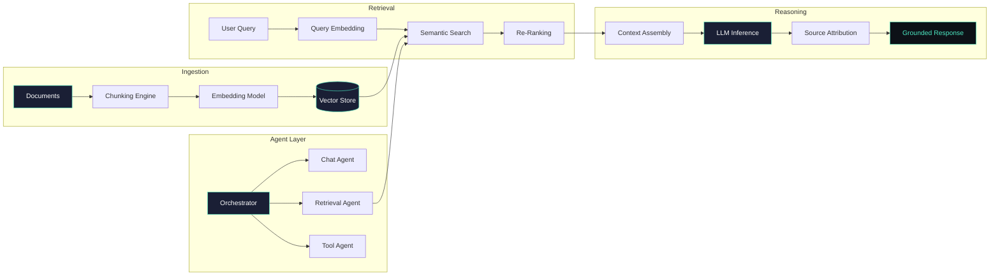

<div align="center">

# Vishal Kumar Kashyap

**AI Engineer** — building production-grade RAG pipelines, multi-agent orchestration systems, and LLM-powered APIs that work at scale.

<br>

[](https://www.linkedin.com/in/vishal-kumar-kashyap/)
[](https://vishal-kumar-kashyap.vercel.app)
[](mailto:kumarvikash10351@gmail.com)

</div>

---

```yaml
name: Vishal Kumar Kashyap
role: AI Engineer · RAG Specialist · Agentic Systems Builder
focus:
  - Multi-agent orchestration with dynamic task routing & memory
  - Retrieval-augmented generation — chunking, indexing, re-ranking, grounding
  - LLM serving & API design — structured outputs, latency optimization
  - Semantic search infrastructure — dense embeddings, vector indexing
  - ML pipeline engineering — training, evaluation, deployment
currently_building: production RAG systems with sub-200ms retrieval latency
open_to: AI Engineer · ML Engineer · GenAI Engineer · Applied AI roles
```

---

## Featured Projects

> Each project below is a full-stack AI system — designed, architected, and shipped end-to-end.

<table>
<tr><td>

### [ARIA v2 — Adaptive Reasoning Intelligence Agent](https://github.com/kumarvishal10351/ARIA-V2)

A multi-agent AI assistant with dynamic reasoning across conversational, retrieval, and tool-execution modules. Routes queries intelligently between live chat, document retrieval via vector search, and system-level command execution.

**Architecture:** Modular multi-agent design with central orchestrator for task delegation and context-aware routing.

| Metric | Value |
|---|---|
| Agent Modules | 3+ (chat, retrieval, tool-exec) |
| Retrieval | Vector embedding pipeline with semantic re-ranking |
| API | FastAPI REST endpoints, low-latency real-time interaction |
| Interface | Voice-based I/O with session continuity |

`Multi-Agent` `RAG` `FastAPI` `Vector Embeddings` `LLMs` `Voice Interface`

</td></tr>
</table>

---

<table>
<tr><td>

### [AI Career Copilot — Resume Intelligence Platform](https://github.com/kumarvishal10351/AI-Career-Copilot)

End-to-end resume intelligence platform: parses resumes, scores against ATS criteria, matches job descriptions, and generates structured interview preparation — all powered by an LLM backbone with structured JSON outputs.

**Architecture:** Modular pipeline separating LLM inference, PDF parsing, scoring engine, and caching layers.

| Metric | Value |
|---|---|
| LLM Backend | Mistral AI with structured JSON outputs |
| Features | ATS scoring, resume rewriting, job matching, interview Q&A |
| Resilience | Retry logic + session-based state for multi-user stability |
| Interface | Streamlit with real-time scoring dashboard |

`Mistral AI` `Streamlit` `NLP` `ATS Scoring` `PDF Parsing` `LLMs`

</td></tr>
</table>

---

<table>
<tr><td>

### [AURA — Adaptive Unified Retrieval Assistant](https://github.com/kumarvishal10351/-AURA-Adaptive-Unified-Retrieval-Assistant)

A retrieval-augmented QA system engineered to minimize hallucinations by grounding every LLM response in semantically retrieved source documents. Designed for enterprise-grade document Q&A reliability.

**Architecture:** Dense vector search → semantic re-ranking → LLM reasoning with source attribution.

| Metric | Value |
|---|---|
| Retrieval | Dense vector search with semantic re-ranking |
| Pipeline | Scalable ingestion → chunking → indexing → query |
| Grounding | Source-attributed responses, hallucination reduction |
| Target | Enterprise document Q&A with high precision |

`RAG` `Vector DB` `Semantic Search` `NLP` `Knowledge Grounding`

</td></tr>
</table>

---

<table>
<tr><td>

### [AI Research Multi-Agent System](https://github.com/kumarvishal10351/AI-Research-Multi-Agent-System)

Multi-agent research system where specialized agents collaborate on complex research tasks — from literature review and data synthesis to insight generation — with coordinated tool use and shared memory.

**Architecture:** Agent swarm with role specialization, shared context store, and orchestrated task decomposition.

`Multi-Agent` `Research Automation` `LLMs` `Tool Use` `Memory Management`

</td></tr>
</table>

---

<table>
<tr><td>

### [FluentCoach — AI Language Learning](https://github.com/kumarvishal10351/FluentCoach)

AI-powered language learning coach that provides real-time conversational practice, pronunciation feedback, and adaptive difficulty scaling using LLMs and speech processing.

**Architecture:** Speech-to-text → LLM conversation engine → text-to-speech with feedback loop.

`Speech Processing` `LLMs` `NLP` `Adaptive Learning` `Python`

</td></tr>
</table>

---

## System Architecture

> How I design RAG & multi-agent systems — from ingestion to inference.



---

## Tech Stack

**AI / ML / GenAI**


**Vector & Search**


**Backend & APIs**


**Data & Databases**


**Infrastructure & DevOps**


---

## GitHub Activity

<div align="center">


&nbsp;&nbsp;


</div>

---

## Writing & Talks

> *Coming soon — technical deep-dives on RAG pipeline optimization, multi-agent design patterns, and LLM evaluation.*

<!-- Uncomment as you publish:
- 📝 [Designing RAG Pipelines That Don't Hallucinate](#) — How I built AURA's retrieval + grounding system
- 📝 [Multi-Agent Architecture: Lessons from ARIA](#) — Orchestration patterns for production agents
- 📝 [LLM Evaluation Beyond BLEU: A Practical Framework](#) — Metrics that actually matter
-->

---

## Education

| Degree | Institution | Year |
|---|---|---|
| **B.Tech**, Computer Science | Rajiv Gandhi Proudyogiki Vishwavidyalaya | 2023 – 2026 |
| **Diploma**, Computer Science | Jharkhand University of Technology | 2020 – 2023 |

---

<div align="center">

*I build AI systems that work in production — not just in notebooks.*

<sub>If you're working on interesting AI problems, let's talk → <a href="mailto:kumarvikash10351@gmail.com">kumarvikash10351@gmail.com</a></sub>

</div>
