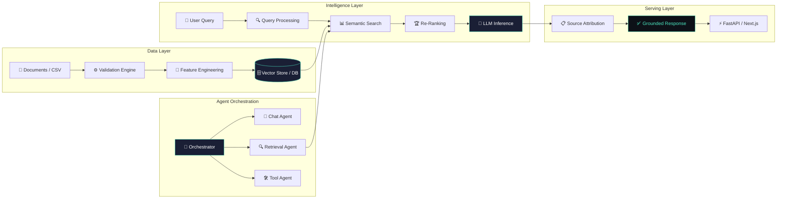

<div align="center">


# Vishal Kumar Kashyap

### AI Engineer · RAG Specialist · Agentic Systems Builder

<p>
  I design and ship production-ready AI systems — from multi-agent orchestration<br>
  and retrieval-augmented generation pipelines, to LLM-powered APIs and semantic search infrastructure.
</p>

<br>

[](https://www.linkedin.com/in/vishal-kumar-kashyap/)
[](https://vishal-kumar-kashyap.vercel.app)
[](mailto:kumarvikash10351@gmail.com)
[](https://github.com/kumarvishal10351)

<br>

> **Open to:** AI Engineer · ML Engineer · GenAI Engineer · Applied AI · RAG / Agentic AI roles

</div>

---

## 〔 01 〕 What I Build

<table>
  <tr>
    <td><b>🤖 LLMs & GenAI</b></td>
    <td>Prompt engineering, structured outputs, fine-tuning, hallucination reduction</td>
  </tr>
  <tr>
    <td><b>🔍 RAG Systems</b></td>
    <td>Semantic retrieval, vector indexing, chunking strategies, re-ranking pipelines</td>
  </tr>
  <tr>
    <td><b>🧠 Agentic AI</b></td>
    <td>Multi-agent orchestration, tool use, dynamic routing, memory management</td>
  </tr>
  <tr>
    <td><b>⚡ APIs & Deployment</b></td>
    <td>FastAPI REST services, Docker, AWS / GCP, production-grade pipelines</td>
  </tr>
  <tr>
    <td><b>🔎 NLP & Search</b></td>
    <td>Semantic similarity, dense embedding pipelines, document Q&A systems</td>
  </tr>
  <tr>
    <td><b>📊 ML Engineering</b></td>
    <td>PyTorch, TensorFlow, Scikit-learn, model evaluation, Streamlit interfaces</td>
  </tr>
</table>

---

## 〔 02 〕 Featured Projects

<details open>
<summary><b><a href="https://github.com/kumarvishal10351/workforce-intelligence-platform">Workforce Intelligence Platform</a></b> &nbsp;|&nbsp; ML Pipeline · FastAPI · React 19 · SHAP Explainability · Live Demo</summary>
<br>

Enterprise-grade, end-to-end ML application for HR executives and organizational strategists. Automates the full ML lifecycle — from strict 4-stage data validation and feature engineering to probabilistic inference, local SHAP attribution, and prescriptive retention playbooks. Deployed live with executive analytics dashboard.

🔗 **[Live Demo →](https://workforce-intelligence-platform-pied.vercel.app/)**

| Component | Detail |
|---|---|
| **ML Pipeline** | Gradient Boosting Classifier — 88.08% ROC-AUC, 87.40% Precision, 76.25% Recall |
| **Validation** | Custom 4-stage engine: File → Schema → Type → Business Rules (zero imputation) |
| **Explainability** | SHAP TreeExplainer for per-employee feature attribution & risk decomposition |
| **Retention Simulator** | Interactive "What-If" analysis with live parameter controls & probability deltas |
| **Architecture** | AI Engine (Python) → FastAPI Backend → React 19 + Vite Frontend |
| **Deployment** | Vercel (frontend) + Uvicorn (API), Swagger docs at `/docs` |

```
workforce-intelligence-platform/
├── ai-engine/          # ML & validation library (training, SHAP, inference)
├── backend/            # FastAPI REST API (predictions, uploads, employees)
└── frontend/           # React 19 + Vite + Tailwind executive dashboard
```

`Gradient Boosting` `SHAP` `FastAPI` `React 19` `Scikit-learn` `Feature Engineering` `MLOps`

</details>

---

<details open>
<summary><b><a href="https://github.com/kumarvishal10351/Company-AI">Company-AI — Autonomous Research Intelligence Platform</a></b> &nbsp;|&nbsp; Next.js 14 · Multi-LLM · Web Crawling · PDF Generation · Discord Bot</summary>
<br>

Enterprise-grade autonomous company research platform. Orchestrates real-time web crawling, Google search discovery via Serper.dev, multi-LLM reasoning via OpenRouter (80+ models), vector PDF report generation, and automated Discord bot dispatches — all within a pixel-perfect pure black ChatGPT-inspired UI.

🔗 **[Live Demo →](https://relu-ai-dev-hiring-virid.vercel.app/)**

| Component | Detail |
|---|---|
| **LLM Orchestration** | OpenRouter multi-model — GPT-4o, Claude 3.5 Sonnet, Gemini 2.0, Mistral Large, DeepSeek V3 |
| **Web Crawling** | Intelligent URL discovery + Cheerio DOM parsing, deduplication & page scoring |
| **Search Engine** | Serper.dev Google Search API for real-time competitive intelligence |
| **PDF Engine** | Client-side vector PDF generation via jsPDF with enterprise dark-theme typography |
| **Discord Integration** | Automated webhook dispatches with structured rich embeds & report metadata |
| **Architecture** | Next.js 14 SSE API orchestrator → Crawler + Search + LLM → Synthesis Report |

```
Company-AI/
├── src/app/api/        # SSE research orchestrator, Discord webhook, model fetcher
├── src/components/     # ChatGPT-style UI: sidebar, prompt bar, report viewer
├── src/lib/            # Crawler, OpenRouter client, Serper client, PDF generator
└── src/hooks/          # Persistent state management for API keys & history
```

`Next.js 14` `OpenRouter` `Multi-LLM` `Web Crawling` `Serper.dev` `jsPDF` `Discord Bot` `SSE`

</details>

---

<details open>
<summary><b><a href="https://github.com/kumarvishal10351/ARIA-V2">ARIA v2 — Adaptive Reasoning Intelligence Agent</a></b> &nbsp;|&nbsp; Multi-Agent · FastAPI · RAG · LLMs · Voice Interface</summary>
<br>

A production-oriented multi-agent AI assistant with dynamic reasoning across conversational, retrieval, and tool-execution modules. ARIA routes queries intelligently — switching between live chat, document retrieval via vector search, and system-level command execution based on context.

| Component | Detail |
|---|---|
| **Architecture** | Modular multi-agent design with a central orchestrator for task delegation |
| **Retrieval** | Vector embedding pipeline with semantic ranking for context-aware, grounded responses |
| **API Layer** | FastAPI REST endpoints enabling low-latency, scalable real-time interaction |
| **Interface** | Voice-based I/O with fallback handling and session continuity |

`Multi-Agent` `RAG` `FastAPI` `Vector Embeddings` `LLMs` `Voice Interface` `Semantic Search`

</details>

---

<details open>
<summary><b><a href="https://github.com/kumarvishal10351/AI-Career-Copilot">AI Career Copilot</a></b> &nbsp;|&nbsp; Mistral AI · Streamlit · NLP · ATS Intelligence · PDF Parsing</summary>
<br>

End-to-end resume intelligence platform that parses resumes, scores them against ATS criteria, matches job descriptions, and generates structured interview preparation material using an LLM backbone.

| Component | Detail |
|---|---|
| **LLM Pipeline** | Mistral AI with structured JSON outputs for section-wise ATS scoring and analysis |
| **Features** | Resume rewriting, job-role matching, interview Q&A generation, improvement suggestions |
| **Engineering** | Modular separation of LLM calls, PDF parsing, caching, and export layers |
| **Resilience** | Retry logic and session-based state management for stable multi-user usage |

`Mistral AI` `Streamlit` `NLP` `ATS Scoring` `PDF Parsing` `LLMs` `Job Matching`

</details>

---

<details open>
<summary><b><a href="https://github.com/kumarvishal10351/-AURA-Adaptive-Unified-Retrieval-Assistant">AURA — Adaptive Unified Retrieval Assistant</a></b> &nbsp;|&nbsp; RAG · Vector Databases · Semantic Search · NLP</summary>
<br>

A retrieval-augmented QA system built to minimize hallucinations by grounding every LLM response in semantically retrieved source documents. Designed for enterprise-grade document Q&A reliability.

| Component | Detail |
|---|---|
| **Retrieval** | Dense vector search with semantic re-ranking for high-precision document matching |
| **Pipeline** | Scalable ingestion, chunking, indexing, and query workflows |
| **LLM Integration** | Combines retrieval context with LLM reasoning to eliminate confabulation |
| **Outcome** | Knowledge-grounded responses suitable for enterprise document Q&A |

`RAG` `Vector DB` `Semantic Search` `NLP` `Knowledge Grounding` `Hallucination Reduction`

</details>

---

## 〔 03 〕 System Architecture

> How I design end-to-end AI systems — from data ingestion to production inference.



---

## 〔 04 〕 Tech Stack

**AI / ML / GenAI**


**Vector & Search**


**Backend & APIs**


**Frontend & UI**


**Data & Databases**


**Infrastructure & Cloud**


---

## 〔 05 〕 GitHub Activity

<div align="center">


&nbsp;


<br><br>


<br><br>


</div>

---

## 〔 06 〕 Education

| Degree | Institution | Year |
|---|---|---|
| B.Tech, Computer Science | Rajiv Gandhi Proudyogiki Vishwavidyalaya | 2023 – 2026 |
| Diploma, Computer Science | Jharkhand University of Technology | 2020 – 2023 |

**Certifications**
- Python with Machine Learning — Briztech Solution (2022)

---

## 〔 07 〕 Writing & Thought Leadership

> *Technical deep-dives coming soon — on RAG pipeline optimization, multi-agent design patterns, and ML explainability.*

<!-- Uncomment and add links as you publish:
- 📝 [Designing RAG Pipelines That Don't Hallucinate](#) — How I built AURA's retrieval + grounding system
- 📝 [Multi-Agent Architecture: Lessons from ARIA](#) — Orchestration patterns for production agents
- 📝 [SHAP in Production: Making ML Decisions Transparent](#) — Workforce Intelligence Platform's explainability layer
-->

---

<div align="center">

*Building AI systems that work in production, not just in notebooks.*

<br>

[](https://www.linkedin.com/in/vishal-kumar-kashyap/)
[](https://vishal-kumar-kashyap.vercel.app)
[](mailto:kumarvikash10351@gmail.com)


</div>
